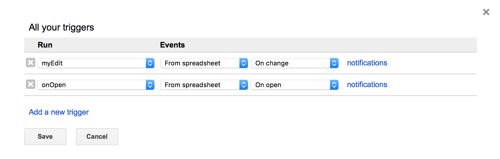

# Google Fusion Table

This page is created for documenting every feature relevant to Google Fusion Table.

This script is built to fecth cmaera APIs on [cam2-camera-api](https://purduecam2project.github.io/CameraDatabaseAPI/#api-cameras-camById). 

## Preparation

### Enable Google API

Before writing any code for the project, we need to enable two Google APIs. Both Google Drive and Google Fusion Table.

1. Visit [Google Developer Console](https://console.developers.google.com/).

2. Look at dashboard page and examine whether or not Google Fusion Table and Google Drive API has already been enabled. If not, click on the library, search for Google Fusion Table API, and click on "ENABLE" button.

3. To enable Google Drive API, follow steps below.

    1. Follow [Official Documentation for Python Version Google Drive API](https://developers.google.com/drive/v3/web/quickstart/python#step_1_turn_on_the_api_name). 

    2. The only field needs to be changed is application name, *e.g.* CAM2 Drive API. 
    
    3. On on the left side bar of your project, go to *Credentials*. Click *Create credentials*, choose *OAuth client ID*. For the type, choose *other*. When OAuth credential is created, you should be able to see the new ID of yours in the list. 
    
    4. At the right end of your client ID, click the download icon. A JSON file has name starts with *client_secret...*  will be downloaded to your computer. Change the name to *client_secret.json* and move it to the *gdrive* folder. 
    
    5. Done.

### Install Google Client Library

Run the following command to install the library using pip:

```
pip install --upgrade google-api-python-client
```
### Configure environment variables
Run the ```export env_var_name=env_var_value``` command for each one of the following environment variable: <br>

| env_var_name | env_var_value | 
|:-----------|:------------|
| CAM2_CLIENT_ID | Get it from team Slack channel|     
| CAM2_CLIENT_SECRET |  Get it from team Slack channel |    
| TOTAL_NO_CAMERAS  |  Number of cameras. *clarify with team Slack channel|     
| SPREADSHEET_FILE_ID  |  Get it from team Slack channel|      


## Authentication and upload files to Google Drive

In the gdrive folder, you can see the python file called 'quickstart.py'. This is the file which uploads the file to the google drive.

```
SCOPES = 'https://www.googleapis.com/auth/drive'
CLIENT_SECRET_FILE = '../../client_secret.json'
APPLICATION_NAME = 'CAM2 Drive API'

def get_credentials():
    """Gets valid user credentials from storage.

    If nothing has been stored, or if the stored credentials are invalid,
    the OAuth2 flow is completed to obtain the new credentials.

    Returns:
        Credentials, the obtained credential.
    """
    home_dir = os.path.expanduser('~')
    credential_dir = os.path.join(home_dir, '.credentials')
    if not os.path.exists(credential_dir):
        os.makedirs(credential_dir)
    credential_path = os.path.join(credential_dir,
                                   'drive-python-quickstart.json')

    store = Storage(credential_path)
    credentials = store.get()
    if not credentials or credentials.invalid:
        flow = client.flow_from_clientsecrets(CLIENT_SECRET_FILE, SCOPES)
        flow.user_agent = APPLICATION_NAME
        if flags:
            credentials = tools.run_flow(flow, store, flags)
        else: # Needed only for compatibility with Python 2.6
            credentials = tools.run(flow, store)
        print('Storing credentials to ' + credential_path)
    return credentials

```

The above code will take the information you have in the **client_secret.json** file get and create a file called **drive-python-quickstart.json** in the **~/.credentials/** directory. This file will be use to authenticate the use of google drive. 

```

file_metadata = { 'name' : 'cameraLocations',
                    'mimeType' : 'application/vnd.google-apps.fusiontable',
                    'parents': os.environ['PARENT_DIR_ID']
                    }
    media = MediaFileUpload('../../cameraLocations.csv',
                            mimetype='text/csv',
                            resumable=True)
    file = service.files().create(body=file_metadata,
                                        media_body=media,
                                        fields='id').execute()
    print ('Successful create File ID: %s' % file.get('id'))

```

The above code is used to upload the file into a particular directory. It only needs to execute once to create the file in the drive. After that, we only need to update the file in the directory. 

In the code,we need to add the id of the parent directory that we would like to place our file in. If you do not add the parent directory, then it will be place in the main directory. You can get the id of the google drive directory by clicking on the property of the directory.

After you execute this code, you can get the file id in the google drive. Write down the file id since you will need that in the next piece of code. 

```

file_metadata = { 'name' : 'cameraLocations',
                    'mimeType' : 'application/vnd.google-apps.fusiontable',
                    }
    media = MediaFileUpload('../../cameraLocations.csv',
                            mimetype='text/csv',
                            resumable=True)
    file = service.files().update(body=file_metadata,
                                        fileId=os.environ['SPREADSHEET_ID'],
                                        media_body=media,
                                        fields='id').execute()
    print ('Successful update File ID: %s' % file.get('id'))

```

After you upload the file, if the file on your local machine is changed, then the above code can be use to update the file on the driver. You need to use the fileID which you get in the previous upload section. You can also get the file id if you click on the property of the file on the google drive. After you add the fileID, you can update the file to the google drive. 

run the following code to create or update file.

```
python quickstart.py
```

**Imprtant Update**

Instead of running `python quickstart.py`, in the same folder *gdrive*, run `python api_getter.py` instead. 

*api_getter* is created in June 2018 based on the content in the quickstart.py with better functions.
 

## Sync Fusion Table with Google Spreadsheet

### Export spreadsheet to Google Fusion table

Since our file is ended with csv, if we upload that CSV file to google drive, it will automatically converted into Google SpreadSheet. So we need to change that file into Google Fusion Table

In google drive, click on new button, and choose "more" option to see if Google Fusion Table already exists in the google drive app. If not, then click on "Connect more apps". Find Google Fusion Table in the apps and add that into the google drive app. Then create new Google Fusion Table, and choose import it from spreadsheet. Then we can create our fusion table in google drive.

### Add the script to the spreadsheet 

* Now we're ready to add our script to our spreadsheet. Back at your spreadsheet, go to Tools --&gt; Script Editor and paste the following code. 

```
/**
 * appsscript script to run in a google spreadsheet that synchronizes its
 * contents with a fusion table by replacing all rows.
 * based on instructions here: 
 * https://htmlpreview.github.io/?https://github.com/fusiontable-gallery/fusion-tables-api-samples/blob/master/FusionTablesSheetSync/docs/reference.html#enabling_advanced_services
 */

// replace with your fusion table's id (from File > About this table)
var TABLE_ID = 'XXXXXXXXXXXXXXXXXXXXXXXXXX';

// first row that has data, as opposed to header information
var FIRST_DATA_ROW = 2;

// true means the spreadsheet and table must have the same column count
var REQUIRE_SAME_COLUMNS = true;

/**
 * replaces all rows in the fusion table identified by TABLE_ID with the
 * current sheet's data, starting at FIRST_DATA_ROW.
 */
function sync() {
    var tasks = FusionTables.Task.list(TABLE_ID);  
    // Only run if there are no outstanding deletions or schema changes.
    if (tasks.totalItems === 0) {
        var sheet = SpreadsheetApp.getActiveSheet();
        var wholeSheet = sheet.getRange(1, 1, sheet.getLastRow(), sheet.getLastColumn());
        var values = wholeSheet.getValues();
        if (values.length > 1) {
            var csvBlob = Utilities.newBlob(convertToCsv_(values), 'application/octet-stream');
            FusionTables.Table.replaceRows(TABLE_ID, csvBlob, { isStrict: REQUIRE_SAME_COLUMNS, startLine: FIRST_DATA_ROW - 1 });
            //Browser.msgBox('Replaced ' + values.length + ' rows in your Fusion Table', Browser.Buttons.OK);
        }
    } else {
        Logger.log('Skipping row replacement because of ' + tasks.totalItems + ' active background task(s)');
    }
};

/**
 * converts the spreadsheet values to a csv string.
 * @param {array} data the spreadsheet values.
 * @return {string} the csv string.
 */
function convertToCsv_(data) {
    // See https://developers.google.com/apps-script/articles/docslist_tutorial#section3
    var csv = '';
    for (var row = 0; row < data.length; row++) {
        for (var col = 0; col < data[row].length; col++) {
            var value = data[row][col].toString();
            if (value.indexOf(',') != -1 ||
                value.indexOf('\n') != -1 ||
                value.indexOf('"') != -1) {
                    // Double-quote values with commas, double quotes, or newlines
                    value = '"' + value.replace(/"/g, '""') + '"';
                    data[row][col] = value;
            }
        };
        // Join each row's columns and add a carriage return to end of each row except the last
        if (row < data.length - 1) {
            csv += data[row].join(',') + '\r\n';
        } else {
            csv += data[row];
        };
    };
    return csv;
};

// create menu buttons
function onOpen() {
    var ss = SpreadsheetApp.getActiveSpreadsheet();
    var menuEntries = [{
        name: "Update Fusion Table",
        functionName: "sync"
    }];
    ss.addMenu("Sync Spreadsheet To Fusion Table", menuEntries);
};
```

* On [Line 9] add Fusion Table's Table ID... It can be get from fusion table property.

        // Add the encrypted table ID of the fusion table here
        var TABLE_ID = '17xnxY......';

* **Optional**: if you have multiple header rows, put the row number of the first data row on this [line](https://gist.github.com/chrislkeller/3013360#file-spreadsheet_to_fusion_tables-js-L12):

            var FIRST_DATA_ROW = 2;

* **Optional**: if you want to allow the spreadsheet to have different columns than the table, change the [line 15](https://gist.github.com/chrislkeller/3013360#file-spreadsheet_to_fusion_tables-js-L15) value to "false":

            var REQUIRE_SAME_COLUMNS = true;

* Click save. You will be prompted to give the project a name. "Update Fusion Tables" works. Click the save icon or go to File --&gt; Save.

* Click Resources  --> Developer's Console Project. Enter the Project Number for the project. The project number can be found in [Google IAM & Admin](https://console.developers.google.com/projectselector/iam-admin/iam). Note that project number is not project id, they are not the same thing. The screen shot below is from another tutorial which is just the screen that we can see after we update our project number.


* Click Resources --> Advanced Google Service, find Google fusion table API, Google SpreadSheet API and enable them. If you don't do that, you will get errors: "Referenced error: FusionTables is not defined"

* Reload the spreadsheet and you will see a new menu item next to help. Mine reads "Sync Spreadsheet To Fusion Table." Click the menu item and you will see an option to "Update Fusion Table." Since our file has more than 100 thousand data points in the file, it may cost more than 5 minutes to execute the script. As long as the file is running, you do not need to worry about the script too much. 

## Syncing 100,000 + entries to Fusion table

When trying to sync 100,000+ table entries using [this script](#add-the-script-to-the-spreadsheet), the Google Apps Script exceeds
its execution time limit (6 minutes). Therefore, another method should be used.

### Previous script 

The previous script's method `replaceRows` replaces all the rows in the fusion table with the rows specified in the 
spreadsheet. 

### New Script

The following script updates the all the rows in the fusion table using `refetch` which refetches the spreadsheet 
which was originally linked to the fusion table. This method takes about 40 seconds. 

<div class="admonition note">
<p class="first admonition-title">Note</p>
<p class="last">To check the execution time go to View -> Execution transcript</p>
</div>

<div class="admonition note">
<p class="first admonition-title">Note</p>
<p class="last">This script prints to the log in case an error occurs and when it's done. 
You can check that by going to View -> Logs</p>
</div>

```
/**
 * AppsScript script to run in a Google Spreadsheet that synchronizes its
 * contents with a Fusion Table by refetching the spreadsheet.
 * @author WebUI Team @ CAM2
 */

/**
 * Add your table ID in File > Project properties > Script Properties in the script editor
 */
var TABLE_ID;

/**
 * This function is only run to check the script is authorized. Call once manually to add triggers.
 */
function checkAuthorization()
{
    var sheet = SpreadsheetApp.getActive();
    ScriptApp.newTrigger("myEdit").forSpreadsheet(sheet).onChange().create();
    ScriptApp.newTrigger("onOpen").forSpreadsheet(sheet).onOpen().create();

    return;
}


/**
 * Event handler for  opening the spreadsheet
 * @param e Event object with following attributes:
 * authMode
 * source
 * triggerUid
 * user
 * @link https://developers.google.com/apps-script/guides/triggers/events
 */
function onOpen(e)
{
  init();
}


/**
 * initializing triggers and menu in spreadsheet
 */
function init(){
  var sheet = SpreadsheetApp.getActive();


  var menuEntries = [{
        name: "Update Fusion Table",
        functionName: "myEdit"
    }];
    sheet.addMenu("Sync Spreadsheet To Fusion Table", menuEntries);

}


/**
 * Event Handler for editing the spreadsheet
 * @param e Event object has the following attributes:
 * authMode
 * oldValue
 * range
 * source
 * triggerUid
 * user
 * value
 * @link https://developers.google.com/apps-script/guides/triggers/events
 */
function myEdit(e){
  Logger.log("change triggered");

  refetch();
  
}


/**
 * Refetches the spreadsheet originally linked to the Fusion table
 * took ~40 secs to refetch 120K records of data
 */
function refetch() {
    try {
        TABLE_ID = PropertiesService.getScriptProperties().getProperty("TABLE_ID");
        if (!TABLE_ID) {

            throw new Error("Add table ID under File > Project properties > Script Properties");
        }
    }
    catch (e) {
        Logger.log(e.message);
        return;
    }
    if (!TABLE_ID) {
        Logger.log("no table ID");
    }


    try {
        var tasks = FusionTables.Task.list(TABLE_ID);
    }
    catch (e) {
        Logger.log(e.message);
        return;
    }

    if (tasks.totalItems == 0) {
        FusionTables.Table.refetchSheet(TABLE_ID);
        Logger.log("Done refetching!");
    }
    else {
        Logger.log("Failed to refetch due to having tasks still running");
    }
}
```

### Steps to configure Google Apps Project
1. Copy and paste the above script in your script editor.
2. Run `checkAuthorization` function to install the triggers and check that the script is authorized.
3. Check that triggers have been properly installed. Go to Edit -> Current Project Trigger. It should look like the 
following :
 
 
4. Go to File -> Project properties -> Script Properties and add your `TABLE_ID`.
5. Refresh your google spreadsheet. You'll see on the top right side of the menu bar `Sync Spreadsheet to Fusion Table`.

Now when a row changes, it will refetch the spreadsheet.

### Potential issues
* This script works as of 07/10/2018 to update 120,000 entries. As the database grows the Google Apps Script might
exceed the execution limit again. In this case use [Fusion table API](https://developers.google.com/fusiontables/docs/v2/reference/) to use different methods to update.
 
 
### Troubleshooting Google Apps Script

* Use `Logger.log` function to print to the log view of the script.
* Go to Views -> Executions to see whether a script is running or not and to see if it failed.
* You can check errors by going to Error Reporting in Google Developer Console.


## Using Google Fusion Tables

This section has been created to aid in the use of Google Fusion Tables in the CAM2 project and therefore, this is not an exhaustive documentation of all features of Google Fusion Tables, that can be found [here](https://developers.google.com/fusiontables/), but only of those features that are relevant/useful for this project.

### About fusion tables
 - "Fusion Tables is an experimental data visualization web application to gather, visualize, and share data tables." - [About Fusion Tables](https://support.google.com/fusiontables/answer/2571232?hl=en)
 - It's a tool for working with tabulated data
 - Fusion tables are created by uploading data tables, for e.g., spreadsheets or CSV files, to Google Drive
 - Advantages of using Google Fusion Tables
   * Filter and summarize across hundreds of thousands of rows
      * As of July 3, 2017 our camera database consists of more than 110,000 cameras and thus, more than 110,000 rows. Using fusion tables allows effecient rendering of our website.
   * We can chart, map, network graph, or use a custom layout for our data - it will always display the latest data values from our table. 
      * We can perform these operations on the fusion tables website itself and then embed the result to our website
      * We can also perform these operations by writing javascript code to post get requests using the fusion tables api
   * Merge two or three tables to generate a single visualization that includes both sets of data
      * This is very relevant for this project - different camera databases can be merged seamlessly because they all have columns of unique camera IDs.
   * We can turn location tables into maps
      * This is the primary reason we started using fusion tables in our project - the cameras data base consists of latitudanal and longitudanal position data for a camera, i.e., location data, and this allows very efficient rendering of our camera location markers on a google map.
   * Excellent API documentation and stackoverflow support community
 
### Creating fusion tables
Before uploading creating fusion tables it is recommended that the tabulated data have 
- Spreadsheets, delimited text files (.csv, .tsv, or .txt), and Keyhole Markup Language files (.kml) to create fusion tables
- Upload tabulated data to google drive
- In Google Drive select 'New' -> 'File' -> 'More' -> 'Google Fusion Tables' -> 'Create and Share'

The fusion table will have the same visibility as the host google drive folder where it is stored. BY default, it's the google drive folder that was open when when the table was created.

<div class="admonition note">
<p class="first admonition-title">Note</p>
<p class="last">if your fusion table contains location data, geocoding will start automatically - <em>cancel it</em>. Only 10,000 data items (less than 10% of our camera database as of July 3, 2017) can be geocoded for free in a 24 hours period. Geocoding is not required to create markers for camera locations on a map, however, it is required for other features described later in this document and hence, the geocoding quota must not be exhausted.</p>
</div>

### Filtering data in fusion tables
In the example below [this](https://fusiontables.google.com/DataSource?docid=1XszW34wSZP2dW4tfBJxX_Tnvmvvqnumd31WMIlxg#rows:id=1) table is used.

1. Use filter button located on top left of fusion table


2. Filter data using column values.


3. Multiple filters can be applied - all filter conditions are logically ANDed.


### Getting HTML and Javascript code for map obtained from location data
In our example, we have used a fusion table with location data and consequently, obtained a 'Map of Latitudes'.

1. Navigate to 'Map of Latitudes'.

2. Tools -> Publish -> Get HTML and Javascript -> happy copying and pasting :)


### Querying data from fusion tables using Javascript
- To update the map layer: see [this post](https://developers.google.com/fusiontables/docs/samples/change_query)

- To send a JSONP request using jQuery: see [this post](https://developers.google.com/fusiontables/docs/samples/basic_jsonp_request)
<div class="admonition note">
<p class="first admonition-title">Tip</p>
<p class="last">To understand how to write the query in code - apply the exact filter condition you are trying to code on the fusion table and then see the string displayed on the the right side of the 'Filter' button.</p>
</div>


### Customizing markers' info windows

By default the markers on the maps have preformatted info window layout: it consists of pairs of all column names and column data for that row on seperate lines. However, the layout of info windows can be customized to a great extent using CSS.

See [this post](https://support.google.com/fusiontables/answer/1244603?hl=en)


